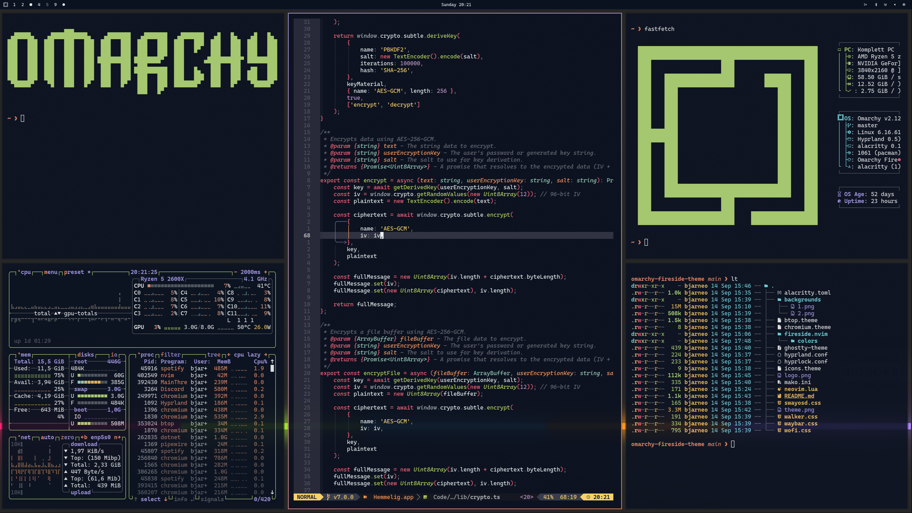

# Omarchy Customer.io Theme

A professional, brand-aligned theme for Omarchy based on the Customer.io color palette. This theme delivers exceptional readability and visual appeal with its carefully balanced combination of Customer.io's signature colors. Perfect for developers who want a modern, cohesive look that reflects Customer.io's brand identity.

The theme features Customer.io's distinctive colors: the signature Abyss dark teal background (#1A3A3A), New Verdant green accents (#7FE87F), Raspberry pink highlights (#E6007E), and complementary blues, purples, and oranges for optimal contrast and brand consistency.

## Color Palette

- **Background**: Abyss (#1A3A3A) - Customer.io's signature dark teal
- **Foreground**: Soft White (#F8F9FA) - Clean, readable text
- **Accents**:
  - New Verdant (#7FE87F) - Signature green
  - Raspberry (#E6007E) - Brand pink
  - Blue (#007FE6) - Professional blue
  - Purple (#7F3FE6) - Creative purple
  - Orange (#FF7F00) - Warm orange
  - Yellow (#FFB000) - Attention yellow

## Screenshot

<p align="center">
  
</p>

## Installation

### Omarchy

To install this theme, simply use the `omarchy-theme-install` command:

```bash
omarchy-theme-install https://github.com/your-username/omarchy-customerio-theme
```

## Included Configurations

This theme includes configurations for:
- Alacritty terminal
- Neovim (using monokai-pro.nvim with Customer.io color overrides)
- Ghostty terminal
- Waybar, Wofi, Walker (Wayland UI components)
- Hyprland and Hyprlock
- btop system monitor
- Mako notification daemon
- Browser themes

## Neovim Setup

The Neovim configuration uses the `loctvl842/monokai-pro.nvim` plugin with Customer.io color overrides. Simply copy the `neovim.lua` file to your Neovim configuration directory.
